# ОТЧЕТ О ЛАБОРАТОРНОЙ РАБОТЕ №6
## СИСТЕМА КОНСТРОЛЯ ВЕРСИЙ
### По курсу: ОСНОВЫ ПРОГРАММИРОВАНИЯ
---
Цель работы: изучение базовых возможностей системы управления версиями, опыт работы с Git Api, опыт работы с локальным и удаленным репозиторием.
---
# Выполнение работы
Сначала необходимо создать аккаунт на GitHub
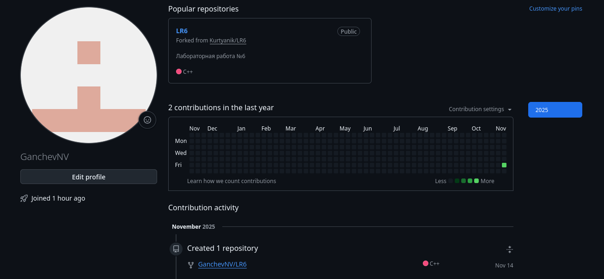
Теперь, необходимо сделать форк (т.е. скопировать) учебный репозиторий https://github.com/Kurtyanik/LR6/. Ссылка на скопированный репозиторий: https://github.com/GanchevNV/LR6.
Дальше, необходимо установить git (в зависимости от платформы установка может немного отличаться, но инструмент работает везде идентично) и прописать в нём своё ФИО с группой, а также электронную почту. Это делается командами:
```bash
git config --global user.name “4417 Ганчев Никита”
git config --global user.email “brawlstarsboost800@gmail.com”
```
Дальше, необходимо скопировать репозиторий. Для этого необходимо воспользоваться командой git clone. После этого, по зданию, необходимо выполнить добавление файла через GitHub. Для этого на странице “Code” открываем Add file -> Upload files и добавить необходимый файл. После этого необходимо выполнить коммит, нажав на кнопку “Commit changes”.
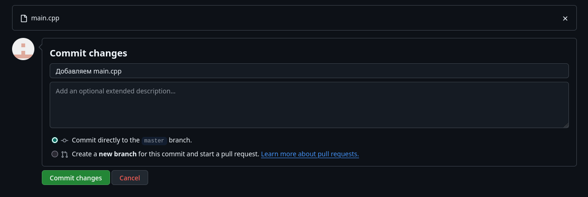
Дальше, нужно вернуть в терминал и, чтобы была самая последняя версия проекта воспользоваться командой git pull.
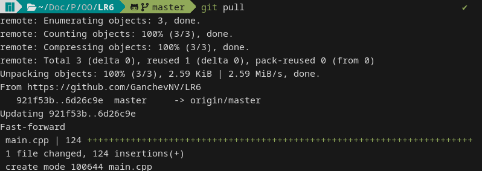
Теперь можно приступать ко второй части работы. Сначала необходимо просмотреть, какие были выполнены коммиты. Для этого нужно воспользоваться командой:
```bash
git log --oneline --graph --all
```
где ключ –oneline даёт удобный вывод изменения в одну строку, вместо большого описания (имя, почта, время и так далее), --graph рисует с помощью символов разные ветви, а --all выводит не только активную ветвь. В итоге вывод будет таким:
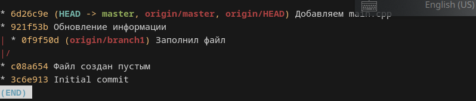
Дальше, нас интересуют послдение изменения в ветках. Для этого воспользуемся инструментом:
```bash
git show {ветка}
```
который показывает последние изменения, которые произошли в данной ветке.
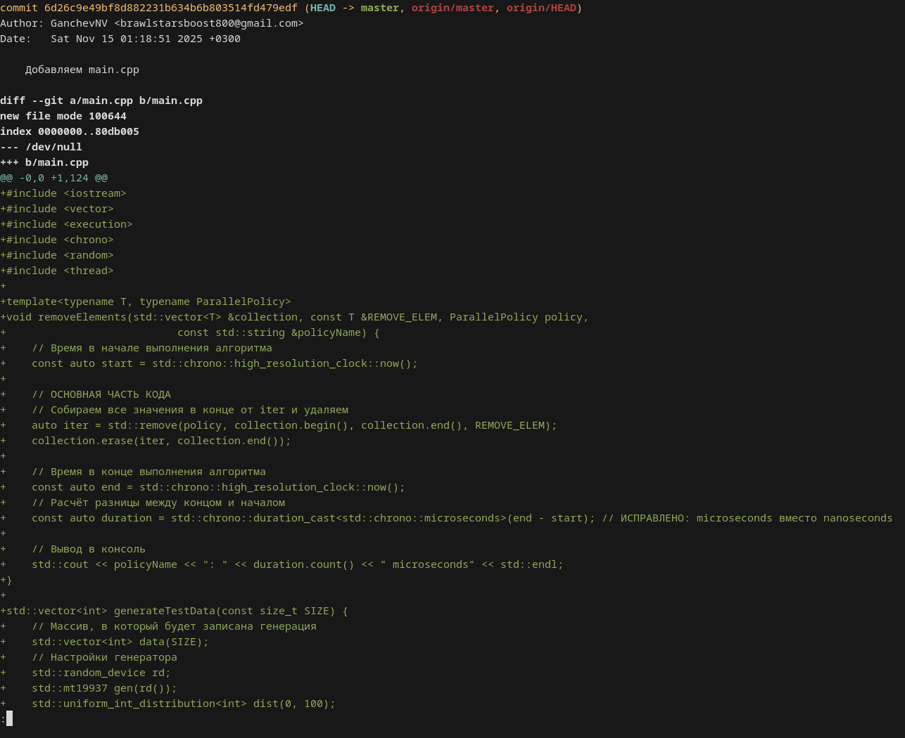
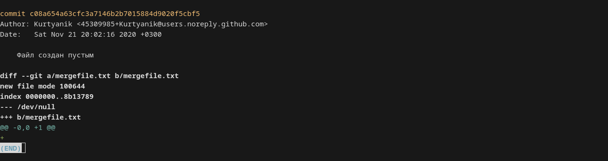
Теперь, по заданию, нужно объединить ветки *master* и *branch1*. Для начала убедимся в том, что в *branch1* -> *mergefile.txt* действительно находится то, что нам нужно. Для этого перейдём в ветку (git checkout branch1) и откроем файл. Так, как выполнение работы производилось на ОС Linux, файл был прочитан с помощью операции cat.
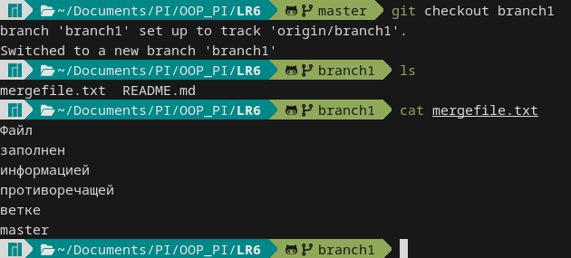
Теперь можно вернуться на основную векту и выполнить операцию слияния.
```bash
git checkout master
git merge branch1
```
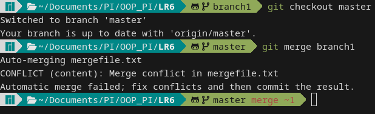
Данная ошибка, очевидно, является ошибкой слияния. Git не знает как поступать с одинаковыми по названию, но разными по содержанию файлами и заставляет пользователя самостоятельно решить, что нужно оставить. Чтобы это исправить необходимо открыть файл в любом текстовом редакторе (в данном случае это будет nano) и убрать ненужные данные (здесь уберём всё, что относится к ветке HEAD
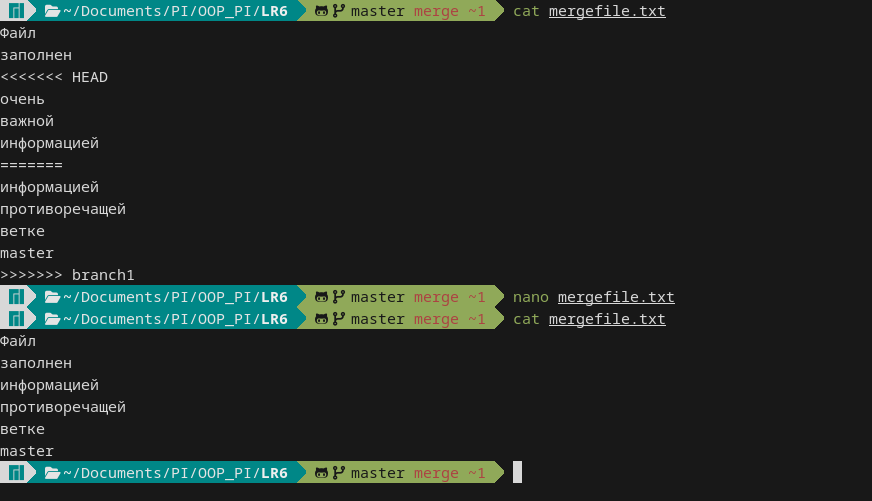
Теперь, нужно добавить файл в очередь коммита, объединить ветки и сделать коммит. 
```bash
git add .
git merge branch1
git commit -m "Сообщение"
```
В итоге, граф коммитов будет выглядеть вот так:
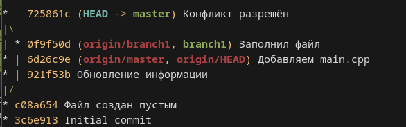
Теперь необходимо удалить старую ветку. Для этого нужно воспользоваться командой:
```bash
git branch -D --remote origin/branch1
```
Дальше нужно было попробовать сделать откат коммита. Для этого был создан файл test.txt, который в первой итерации (38d82f0) хранил текст “Здесь должен быть этот текст”, а во второй (2f20391) “Этот текст точно не должен быть здесь”. Чтобы откатиться используется команда:
```bash
git reset {хеш} --hard
```
где ключ hard используется для грубого возврата к прошлому коммиту (можно использовать HEAD~1, чтобы легко идти назад, не запоминая хеш).
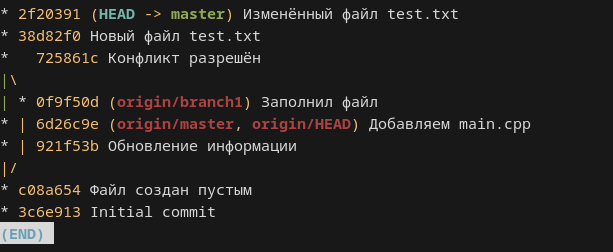
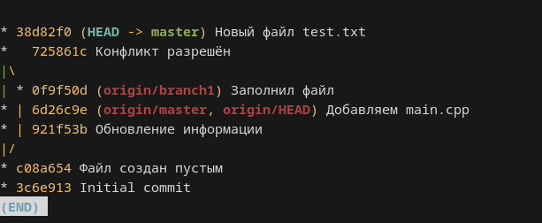
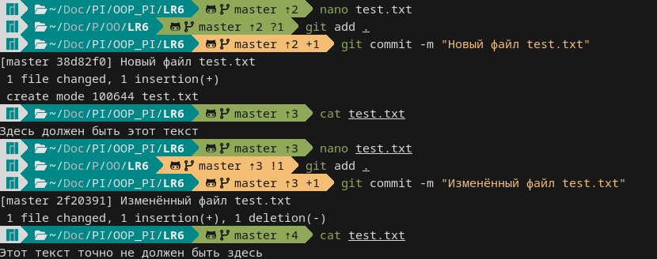
Ну и наконец, необходимо загрузить всё это дело в гитхаб. Для этого необходимо вызвать git push и ввести в него юзернейм аккаунта и ключ (этот ключ можно получить в *Settings -> Developer settings -> Personal access token -> Token (Classic)* и дать ему, как минимум право на управление репозиториями (*repo*)).
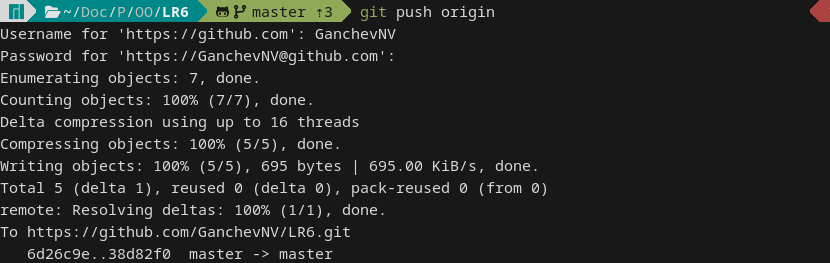
Теперь необходимо создать новую ветку, в которой будет находиться этот отчёт. Для этого необходимо использовать git checkout -b protocol. Как только редактирование protocol было заверешено, можно получить историю операций в отформатированном виде:
picture 15 пон
---
# Вывод
В ходе выполнения лабораторной работы были освоены базовые принципы работы с системой контроля версий Git, также были изучены простые операции с ветками, способы разрешения слияний и научились работать с удалённым хранилищем.
